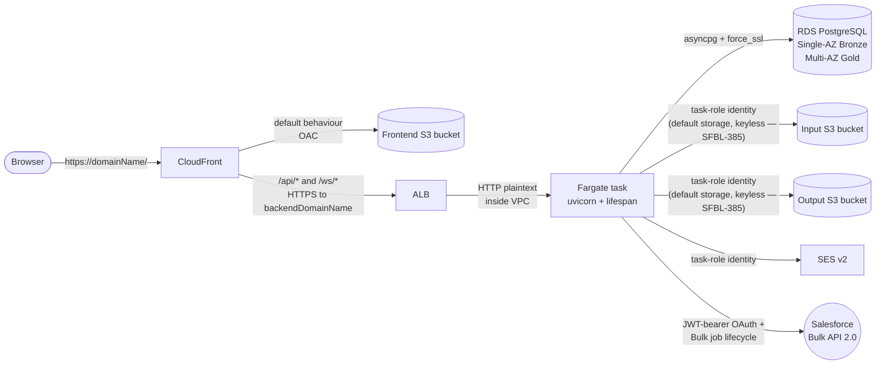
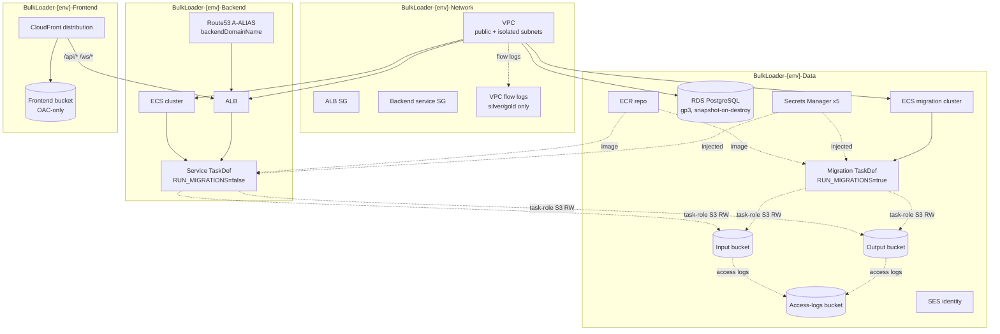
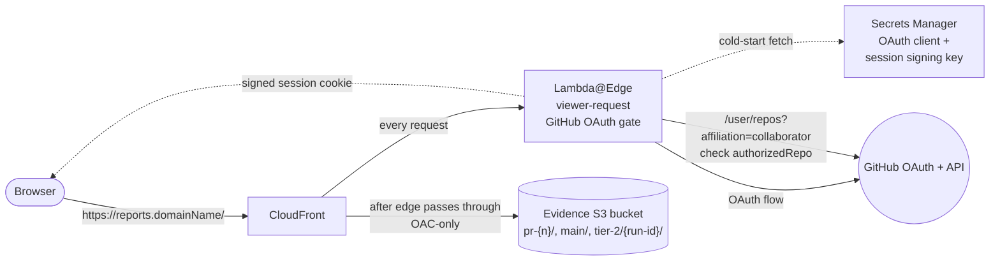
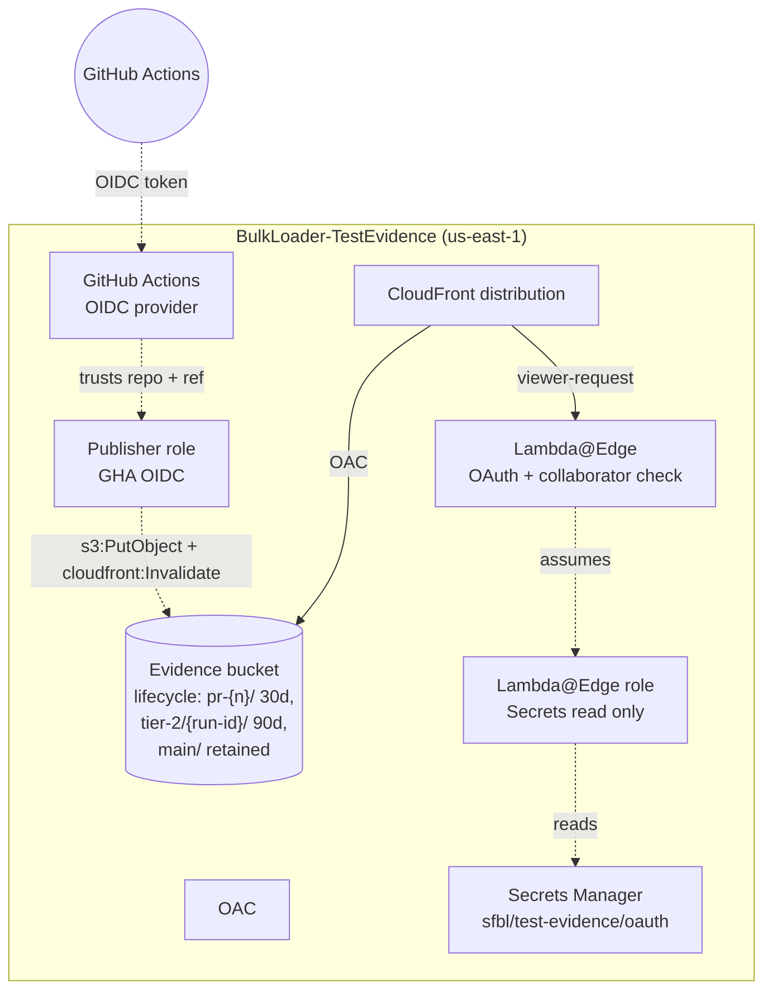
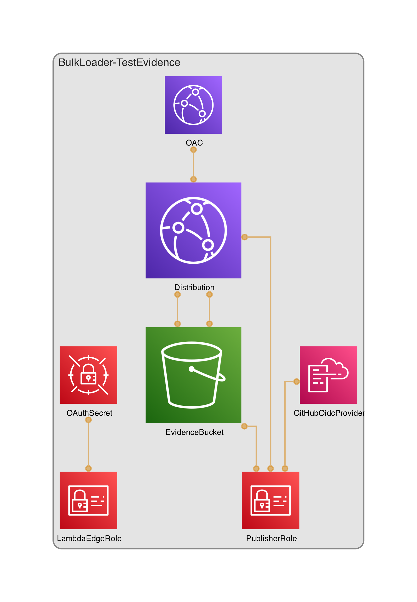
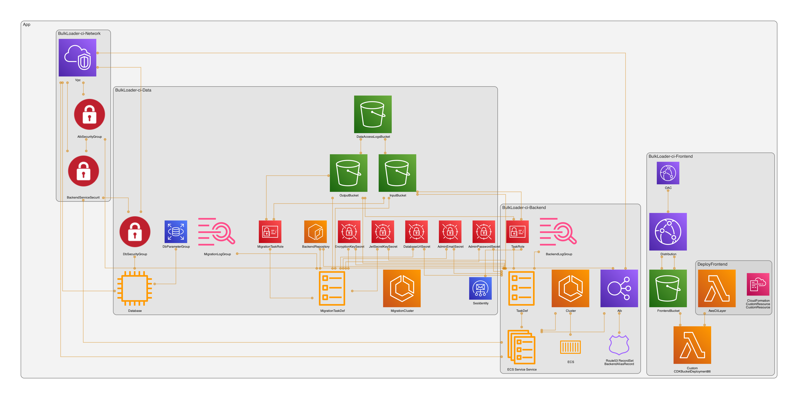

# AWS topology

Conceptual view of the `aws_hosted` profile. For the implementation-level
diagram (every CDK construct, every cross-stack reference) see the
auto-generated [`diagrams/aws-stacks.png`](#auto-generated-cdk-diagram)
below — that one is regenerated from `cdk.out/tree.json`, this one is
hand-maintained for shape only.

## Request path



> On `aws_hosted` the implicit/default Input and Output storage resolves to
> the first-party Input/Output buckets via the **ECS task role's** credential
> chain (no stored keys) — the task role carries scoped object RW + ListBucket
> on exactly those two buckets. External / cross-account buckets still use
> per-Connection BYO IAM keys (the non-default path).

## Stack ownership



> **Manual step on first deploy:** the Route53 A-ALIAS for
> `domainName` → CloudFront is **not** auto-created by CDK (only the
> `backendDomainName` → ALB alias is). See `docs/deployment/aws.md`
> step 11.

## Test evidence host (SFBL-334)

The test evidence dashboard is a **standalone** CDK app —
`bin/test-evidence-app.ts` — deployed independently of the per-env
runtime stacks above. It serves the cross-layer Allure reports
(Playwright + pytest) and is **pinned to `us-east-1`** because the
Lambda@Edge OAuth gate can only originate from that region.

### Request path



The Lambda gate runs on every request (cache disabled at the edge for
correctness). A user is admitted only if they're an explicit
collaborator on `eelywasa/sf-bulk-loader` — verified via the
`affiliation=collaborator` filter because the obvious
`permissions.pull` check would admit anyone with a GitHub account on
a public repo.

### Stack ownership



### Deploy + access notes

- Deploy via `npm run deploy:test-evidence` (calls
  `cdk deploy --app 'npx ts-node --prefer-ts-exts bin/test-evidence-app.ts'
  --all`). Synth runs against `cdk.json` + `cdk.context.json`'s
  `testEvidence` block.
- Without `testEvidence.domainName` + `.certificateArn` the OAuth wiring
  is skipped — useful for early synth smoke checks — and the
  distribution is **not** authentication-gated. Operator sees a
  `cdk.Annotations.addWarning` to that effect on synth.
- ACM certificate for the custom domain must live in `us-east-1`
  (CloudFront-edge requirement, independent of the Lambda@Edge one).
- Secrets Manager seeding + GitHub OAuth App registration are tracked
  separately in SFBL-350 J (`docs/operations/test-evidence-runbook.md`).

### Auto-generated CDK diagram (test-evidence stack)

The construct-level view of just the TestEvidenceStack, regenerated
separately from the env-based stacks above:



Regenerate with `cd infrastructure && npm run diagram:test-evidence`.
The PNG above is generated with the OAuth wiring **skipped** (no
`testEvidence.domainName` in committed `cdk.json`). When the operator
deploys with a real domain configured, the Lambda@Edge function +
version constructs additionally appear in the topology.

## Auto-generated CDK diagram

The full construct-level diagram, including every secret, log group,
custom resource, and security-group rule, is generated by
[`cdk-dia`](https://github.com/pistazie/cdk-dia) from the synthesised
`cdk.out/tree.json`:



### Regenerating

```bash
cd infrastructure
npm run diagram
```

The script runs `cdk synth -c env=ci` (using the safe non-routable
placeholders in `cdk.json`'s `ci` env), then `cdk-dia` against the
resulting tree, and writes the PNG to `docs/architecture/diagrams/`.
Graphviz must be on `PATH` (`brew install graphviz` on macOS,
`apt-get install graphviz` on Ubuntu).

The CI synth runs on every PR that touches `infrastructure/**`, so the
diagram and the deployed reality won't drift in *structure* — but the
PNG is committed manually. Treat regeneration as part of any PR that
adds, removes, or renames a CDK construct, alongside any necessary
update to the hand-drawn Mermaid views above.

## Drift checklist for diagram maintainers

When making changes to `infrastructure/lib/`, refresh the relevant
diagrams in the same PR:

- Added or removed a stack, S3 bucket, RDS instance, ALB, CloudFront
  origin, or CloudWatch log group → **regenerate `aws-stacks.png`**
  (`npm run diagram`) and review the *Stack ownership* Mermaid diagram
  above.
- Changed how a request flows (new path/behaviour on CloudFront, new
  origin, new direct external dependency from ECS) → **update the
  *Request path* Mermaid diagram**.
- Renamed a secret, SSM parameter, or stack output that is referenced
  in the Mermaid labels → update the diagram label so it stays
  greppable.
- Touched `bin/test-evidence-app.ts` or `lib/test-evidence-stack.ts` →
  review the *Test evidence host (SFBL-334)* section above; the
  Lambda@Edge OAuth flow and the IAM trust topology are easy to
  mis-document silently.

If a PR touches `infrastructure/lib/` but doesn't refresh the diagrams,
reviewers should flag it. Stale topology diagrams are worse than no
diagram — they actively mislead operators trying to debug the running
system.
