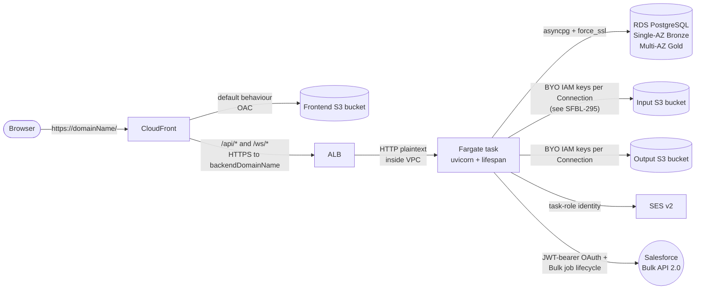

# AWS topology

Conceptual view of the `aws_hosted` profile. For the implementation-level
diagram (every CDK construct, every cross-stack reference) see the
auto-generated [`diagrams/aws-stacks.png`](#auto-generated-cdk-diagram)
below — that one is regenerated from `cdk.out/tree.json`, this one is
hand-maintained for shape only.

## Request path



## Stack ownership

```mermaid
flowchart TB
  subgraph network[BulkLoader-{env}-Network]
    vpc[VPC<br/>public + isolated subnets]
    sgalb[ALB SG]
    sgsvc[Backend service SG]
  end

  subgraph data[BulkLoader-{env}-Data]
    ecr[ECR repo]
    rds[(RDS PostgreSQL)]
    s3in[(Input bucket)]
    s3out[(Output bucket)]
    secrets[Secrets Manager x5]
    sesId[SES identity]
  end

  subgraph backend[BulkLoader-{env}-Backend]
    cluster[ECS cluster]
    svctd[Service TaskDef<br/>RUN_MIGRATIONS=false]
    migtd[Migration TaskDef<br/>RUN_MIGRATIONS=true]
    alb[ALB]
    routeApi[Route53 A-ALIAS<br/>backendDomainName]
  end

  subgraph frontend[BulkLoader-{env}-Frontend]
    s3fe[(Frontend bucket<br/>OAC-only)]
    cfDist[CloudFront distribution]
  end

  vpc --> rds
  vpc --> alb
  vpc --> cluster
  ecr -.image.-> svctd
  ecr -.image.-> migtd
  secrets -.injected.-> svctd
  secrets -.injected.-> migtd
  cluster --> svctd
  cluster --> migtd
  alb --> svctd
  cfDist --> s3fe
  cfDist -->|"/api/* /ws/*"| alb
  routeApi --> alb
```

> **Manual step on first deploy:** the Route53 A-ALIAS for
> `domainName` → CloudFront is **not** auto-created by CDK (only the
> `backendDomainName` → ALB alias is). See `docs/deployment/aws.md`
> step 11.

## Auto-generated CDK diagram

The full construct-level diagram, including every secret, log group,
custom resource, and security-group rule, is generated by
[`cdk-dia`](https://github.com/pistazie/cdk-dia) from the synthesised
`cdk.out/tree.json`:


### Regenerating

```bash
cd infrastructure
npm run diagram
```

The script runs `cdk synth -c env=ci` (using the safe non-routable
placeholders in `cdk.json`'s `ci` env), then `cdk-dia` against the
resulting tree, and writes the PNG to `docs/architecture/diagrams/`.
Graphviz must be on `PATH` (`brew install graphviz` on macOS,
`apt-get install graphviz` on Ubuntu).

The CI synth runs on every PR that touches `infrastructure/**`, so the
diagram and the deployed reality won't drift in *structure* — but the
PNG is committed manually. Treat regeneration as part of any PR that
adds, removes, or renames a CDK construct, alongside any necessary
update to the hand-drawn Mermaid views above.

## Drift checklist for diagram maintainers

When making changes to `infrastructure/lib/`, refresh the relevant
diagrams in the same PR:

- Added or removed a stack, S3 bucket, RDS instance, ALB, CloudFront
  origin, or CloudWatch log group → **regenerate `aws-stacks.png`**
  (`npm run diagram`) and review the *Stack ownership* Mermaid diagram
  above.
- Changed how a request flows (new path/behaviour on CloudFront, new
  origin, new direct external dependency from ECS) → **update the
  *Request path* Mermaid diagram**.
- Renamed a secret, SSM parameter, or stack output that is referenced
  in the Mermaid labels → update the diagram label so it stays
  greppable.

If a PR touches `infrastructure/lib/` but doesn't refresh the diagrams,
reviewers should flag it. Stale topology diagrams are worse than no
diagram — they actively mislead operators trying to debug the running
system.
